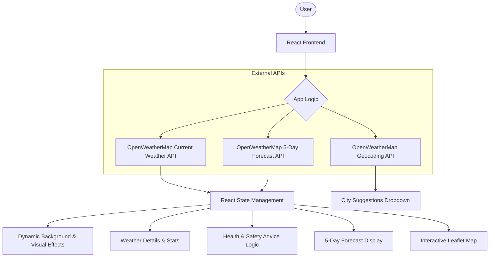
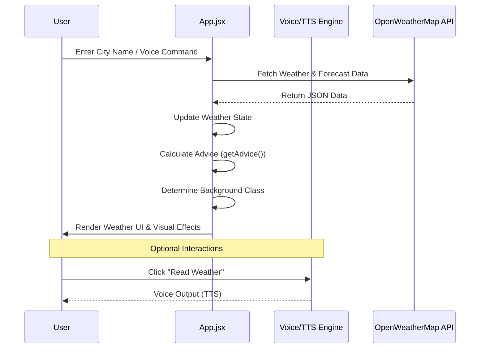
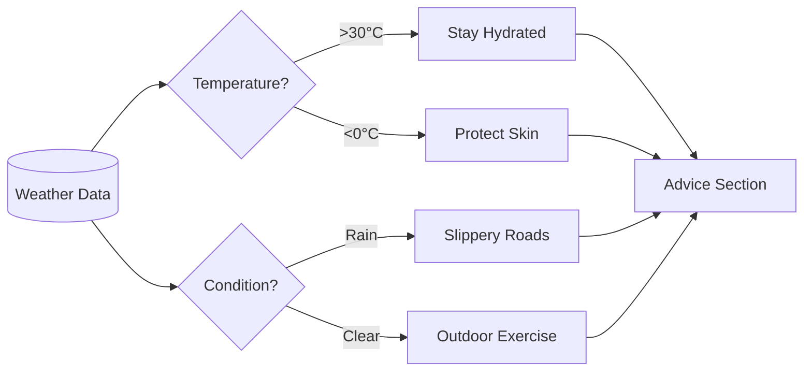

# Project Architecture & Workflow

This document outlines the technical workflow and logic flow of the Weather Forecasting Application.

## 1. High-Level System Architecture

## 2. Component Workflow (Search & Fetch)

The following diagram describes the sequence of events when a user searches for a city.

## 3. Data Processing Logic (getAdvice)

The application includes an advice engine that processes raw weather data into human-readable tips.

## 4. Project Structure

- **`src/App.jsx`**: The core controller. Handles API calls, state management, and main UI layout.
- **`src/WeatherMap.jsx`**: Manages the Leaflet interactive map and coordinate selection.
- **`src/App.css`**: Contains all glassmorphism styles, weather-based background gradients, and animations.
- **`src/main.jsx`**: Entry point for the React application.

---

> [!NOTE]
> Some sections (Advice, Map, and certain Search Buttons) are currently commented out in the codebase as per recent configuration changes but can be re-enabled in `App.jsx`.
